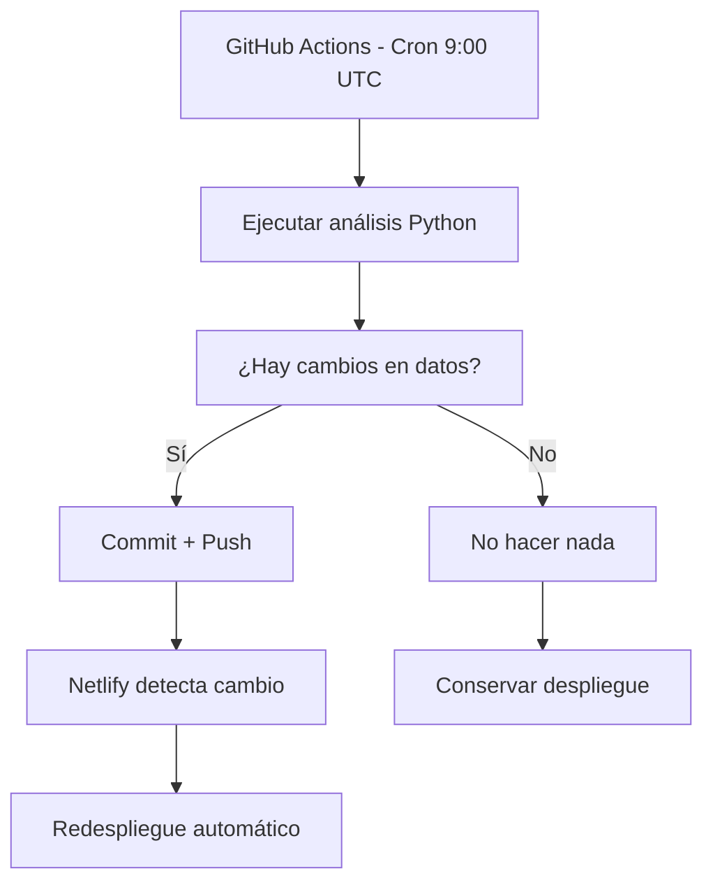

# Optimización de Despliegues en Netlify

## 🎯 Problema: Límite de 100 Despliegues Mensuales

Netlify tiene un límite de **100 despliegues por mes** en el plan gratuito. Con actualizaciones diarias (22 días laborables), necesitamos optimizar para no exceder este límite.

## 💡 Estrategia de Optimización

### 1. **Despliegues Inteligentes con GitHub Actions**

#### ✅ Ventajas:
- **Solo redespliegue cuando hay cambios reales** en los datos
- **Conserva despliegues** cuando el mercado no tiene actualizaciones
- **Ejecución automática** de lunes a viernes
- **Control total** sobre cuándo se activa un redespliegue

#### 📊 Estimación de Uso:
- **Días laborables por mes**: ~22 días
- **Despliegues con cambios**: ~15-18 (no todos los días hay cambios significativos)
- **Despliegues manuales**: ~5-10 por mes
- **Total estimado**: ~25-30 despliegues/mes (muy por debajo del límite)

### 2. **Workflows Configurados**

#### 🔄 `daily-analysis.yml` - Automatización Diaria
```yaml
# Ejecuta de lunes a viernes a las 9:00 UTC
# Solo hace commit/push si detecta cambios en los datos
# Netlify solo redespliegue cuando hay commits nuevos
```

**Características:**
- ✅ Detección inteligente de cambios
- ✅ Cache de dependencias Python
- ✅ Solo redespliegue si hay datos nuevos
- ✅ Logs informativos sobre el estado

#### 🎛️ `manual-analysis.yml` - Control Manual
```yaml
# Permite ejecución manual desde GitHub Actions
# Opción para forzar redespliegue aunque no haya cambios
# Soporte para análisis estándar o mejorado
```

**Características:**
- ✅ Ejecución bajo demanda
- ✅ Opción de forzar redespliegue
- ✅ Selección de tipo de análisis
- ✅ Control total del usuario

### 3. **Flujo de Trabajo Optimizado**



### 4. **Monitoreo y Control**

#### 📈 Seguimiento de Uso:
1. **GitHub Actions**: Ve a `Actions` tab para ver ejecuciones
2. **Netlify Deploys**: Revisa el panel de despliegues
3. **Logs detallados**: Cada workflow muestra si hubo cambios

#### 🎛️ Control Manual:
1. **Ir a GitHub** → `Actions` → `Manual NASDAQ Analysis`
2. **Click "Run workflow"**
3. **Seleccionar opciones**:
   - Tipo de análisis (standard/enhanced)
   - Forzar redespliegue (true/false)

### 5. **Configuración de Emergencia**

Si necesitas **más control** sobre los despliegues:

#### Opción A: Desactivar Auto-Deploy en Netlify
```bash
# En Netlify Settings → Build & Deploy → Continuous Deployment
# Desactivar "Auto publishing"
# Usar Deploy Hooks manuales cuando sea necesario
```

#### Opción B: Branch Strategy
```bash
# Crear branch 'production' para despliegues
# GitHub Actions actualiza 'main'
# Merge manual a 'production' cuando quieras redesplegar
```

### 6. **Mejores Prácticas**

#### ✅ Hacer:
- Revisar logs de GitHub Actions regularmente
- Usar el workflow manual para pruebas
- Monitorear el contador de despliegues en Netlify
- Hacer commits descriptivos para tracking

#### ❌ Evitar:
- Commits frecuentes sin cambios reales
- Forzar redespliegues innecesarios
- Modificar archivos que no afectan la funcionalidad

### 7. **Plan de Contingencia**

Si te acercas al límite de 100 despliegues:

1. **Reducir frecuencia**: Cambiar cron a 3 veces por semana
2. **Batch updates**: Acumular cambios y hacer un solo commit
3. **Upgrade plan**: Considerar Netlify Pro (500 despliegues/mes)
4. **Migrar a Vercel**: Sin límites de despliegue en plan gratuito

## 🚀 Resultado Esperado

- **Automatización completa** de actualizaciones
- **Uso eficiente** de despliegues de Netlify (~25-30/mes)
- **Control total** sobre cuándo redesplegar
- **Flexibilidad** para análisis manuales cuando sea necesario
- **Monitoreo claro** del uso de recursos

Esta estrategia te permite mantener tu aplicación actualizada automáticamente mientras optimizas el uso de los despliegues de Netlify.